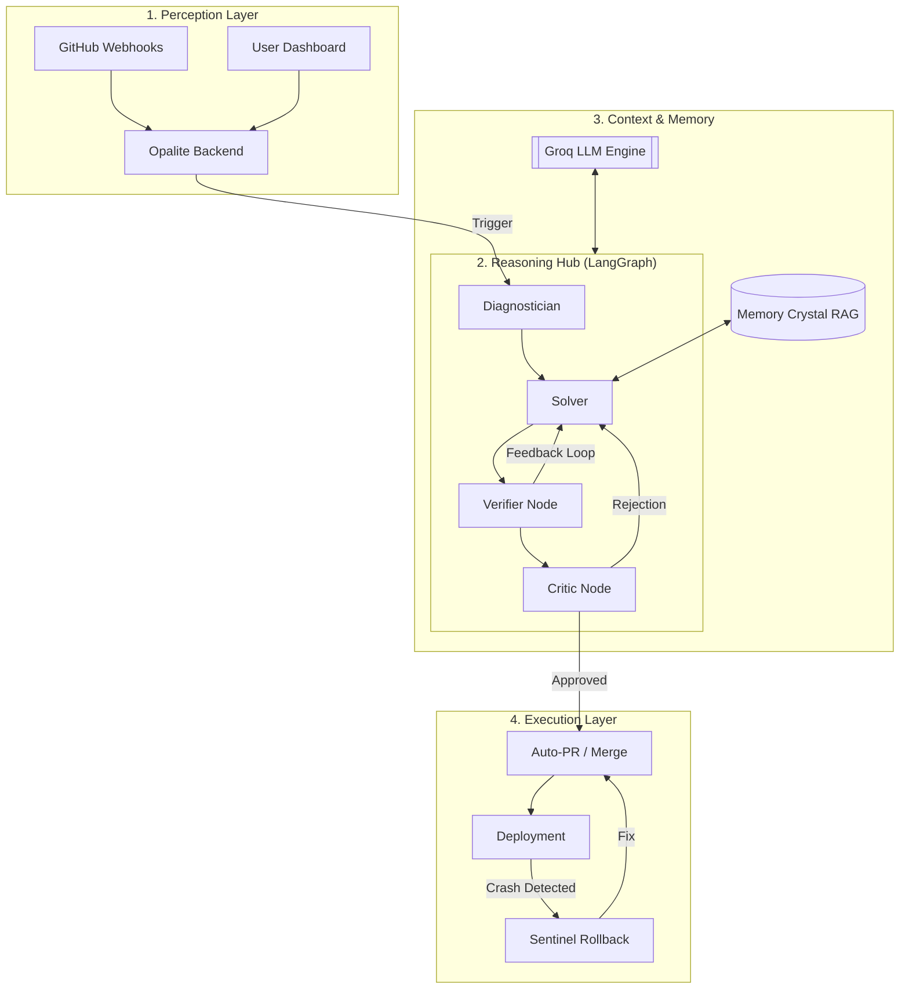

## 🏗️ 1. System Architecture
Opalite OS is built on a **Modular Multi-Agent State Machine**. Here is the high-level flow from detection to autonomous deployment:

---

## 🚀 2. The Vision: From Manual to Autonomous
Most CI/CD tools just **notify** you when things break. Opalite **heals** them. 
We’ve moved past "Monitoring" into "Autonomous Operations." Opalite functions as a digital Site Reliability Engineer (SRE) that never sleeps.

---

## 🛠️ 3. The Tech Stack (The "Brain")
*   **LLM Engine:** Groq (Llama 3.3 70B). Ultra-low latency inference (~300 tokens/sec). Every millisecond matters when production is down.
*   **Orchestration:** LangGraph (State Machine). Zero-shot prompts are fragile; our cyclical state-machine architecture ensures self-correction via feedback loops.
*   **Compatibility:** Fully optimized for **Python 3.14**, featuring a custom lightweight **Opalite-JSON Memory Engine** to bypass legacy Pydantic conflicts.
*   **Backend:** FastAPI (Asynchronous) | **Frontend:** Vanilla JS with Tailwind CSS for glassmorphic premium UI.

---

## 💡 4. What We Do Better (Specific Edge)
| Feature | Competitors (e.g., Sentry, standard AI assistants) | **Opalite OS** |
|---|---|---|
| **Actionability** | Only show you the error logs. | **Writes, tests, and deploys the diff autonomously.** |
| **Verification** | AI "guesses" a fix with no proof. | **Executes fix in a Pytest Sandbox before the PR.** |
| **Memory** | Siloed and forgetful. | **Cross-Repo RAG** applies Repo A fixes to Repo B instantly. |
| **Safety Guard** | PR is the only guard. | **Sentinel Rollback** reverts Git tree if post-deploy crashes occur. |

---

## 🧠 5. Innovation Deep Dive
### **The Memory Crystal (JSON-based RAG)**
Our RAG system doesn't just store text; it stores **Fix-Tuples** (Log context + Code fix). Using similarity matching, it identifies recurring patterns (e.g., "Invalid Image Path in Dockerfile") and applies verified solutions in < 2 seconds.

### **The Verifier Sandbox**
We don't trust the AI blindly. The **Verifier Node** clones a temp repository, applies the patch, and runs `python -m pytest`. If tests fail, the **Critic Node** triggers a retry with the failure logs as feedback—simulating a real human developer cycle.

---

## 🤖 6. Agentic Intelligence (For SurveySparrow Judges)
**Opalite OS is an "Agentic Operating System," not just a bot.**
*   **Cyclical Reasoning:** We don't use linear flows. Our **LangGraph state machine** allows agents to iterate and self-correct (solving → verifying → failing → solving again).
*   **Autonomous Tooling:** The agent has full agency over the Repo (REST API), the Code (Git Database), and the Environment (Shell Sandbox).
*   **Collaborative Multi-Agent:** We use distinct specialist agents (Diagnostician, Solver, Verifier, Critic) that "peer review" each other to ensure zero-hallucination fixes.

**Agentic Deep Dive:** See the **[AGENTIC_ARCHITECTURE.md](file:///C:/Users/Dk/.gemini/antigravity/brain/12d39119-a4e2-4c20-b734-81d25e5a4052/AGENTIC_ARCHITECTURE.md)** for technical details on our loops and state management.

*   **Continuous Integration (CI):** 
    *   **Diagnose:** Identifies root cause from raw logs.
    *   **Research:** Fetches only the relevant source code (Context Builder).
    *   **Verify:** Sandbox execution to prevent "Bad PRs."
*   **Continuous Deployment (CD):** 
    *   **Auto-Merge:** One-click or fully autonomous merging of verified PRs.
    *   **Sentinel Rollback:** Monitors `/health` check and rolls back Git HEAD on failure.

---

## 🎯 6. Explaining the UX to the Jury
"Look at our dashboard. You see a real-time stream of **AI Agency**. You aren't just looking at logs; you're watching a digital agent move through a reasoning state machine. From 'Syncing Repos' via GitHub Auth to 'Etching fixes to Memory,' Opalite is a complete OS for the future of software reliability."

---

## 📈 7. The Marketing & Business Case (Winning the Business Jury)
*   **The Hook:** *"Stop waking up at 3 AM for CI/CD fires. Opalite is your autonomous SRE that fixes the bug before you even see the notification."*
*   **Target Market:** Startups without dedicated DevOps and Enterprises looking to reduce "Mean Time to Recovery" (MTTR).
*   **ROI:** Turns your DevOps from a cost center into a **Revenue Protection Engine**.

**Full Strategy:** Review the **[MARKETING_DECK.md](file:///C:/Users/Dk/.gemini/antigravity/brain/12d39119-a4e2-4c20-b734-81d25e5a4052/MARKETING_DECK.md)** for deep market numbers and monetization tiers.

