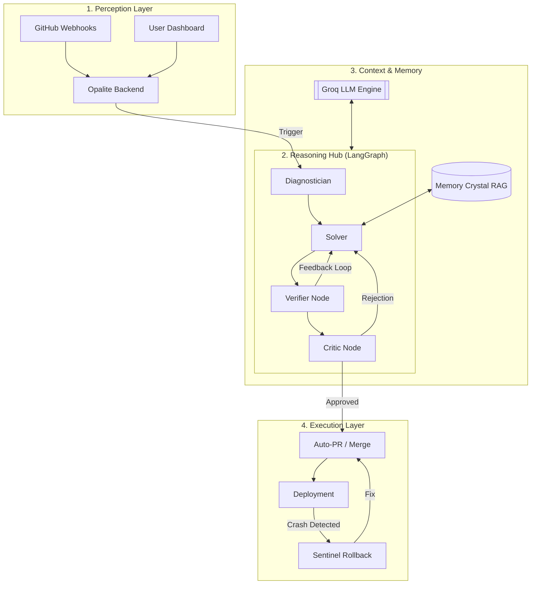

# 🏗️ Opalite OS: System Architecture

The following diagram visualizes the autonomous self-healing lifecycle, multi-agent orchestration, and the federated integration layer.

## 🧩 Architectural Component Breakdown

### 1. **Ingestion Layer (FastAPI)**
The high-performance entry point that manages authenticated user sessions (GitHub PAT) and listens for asynchronous failure events.

### 2. **Agentic Orchestration (LangGraph)**
The "Thinking" layer. Instead of a linear script, LangGraph allows for **cyclical reasoning**. The **Critic** and **Verifier** act as safety gates, forcing the **Solver** to self-correct until the code patch is perfect.

### 3. **Intelligence Engine (Groq + RAG)**
*   **Groq:** Provides ultra-fast inference for real-time healing.
*   **Memory Crystal:** A vector-similarity store that allows the agent to recall how it fixed similar bugs in other repositories, effectively "learning" over time.

### 4. **Remediation Layer**
*   **Verifier (Sandbox):** Executes the fix in an isolated environment to prevent breaking production further.
*   **Deployer:** Manages Git history (branches/PRs), handles auto-merges, and executes emergency rollbacks if health checks fail.
